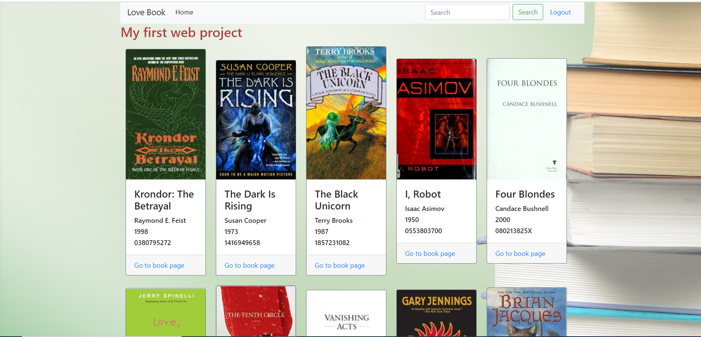

# Project 1: Book Review

This is a homework project of my web programming courses.
Use Flask and PostgresSQL as backend server
Books data from goodread

You can register for a new account, login and leave comment about books
Here is some images about my webapp

# Install:
  pip install -r requirements.txt
  
  
Web Programming with Python and JavaScript
